# Exploratory Data Analysis


```python
from bank_marketing import *
```

## Import Data

The first step of data preparation is to import data. We use `pandas`'s `read_csv()` to import data and take care of data types, true/false values and missing values.


```python
bank_mkt = import_dataset("../data/BankMarketing.csv")
```

## Exploratory Data Analysis

Exploratory Data Analysis is a process to explore the dataset with no assumptions or hypothesis. The objective is to give us enough insights for the future work.

There are many visualization libraries in Python. Pandas has its own plot API based on matplotlib and we will also use Seaborn and Altair. Seaborn is a Python data visualization library based on matplotlib. It provides a high-level interface for drawing attractive and informative statistical graphics. Altair is a declarative statistical visualization library for Python, based on Vega and Vega-Lite. Both libraries provide easy to use APIs and produce beautiful graphs.

Let's first inpect the outcome distribution. As we can see below, the dataset is imbalanced. With 41188 rows of data, only 11.2% have positive outcome.


```python
bank_mkt["y"].count()
```


    41176


```python
bank_mkt["y"].sum()/bank_mkt["y"].count()
```


    0.11266271614532737


```python
y_count = bank_mkt["y"].value_counts().plot(kind = "bar", title="Imbalanced Outcome")
```


    
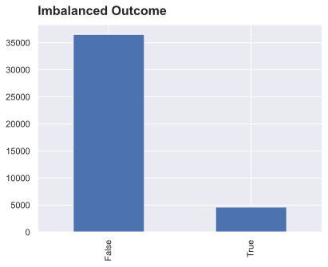
    


Using `info()` we can see that most of features concerning the client are categorical/boolean type. And some fields such as `job`, `marital`, `education`, etc. are missing.


```python
bank_mkt.info()
```

    <class 'pandas.core.frame.DataFrame'>
    RangeIndex: 41176 entries, 0 to 41175
    Data columns (total 21 columns):
     #   Column          Non-Null Count  Dtype   
    ---  ------          --------------  -----   
     0   age             41176 non-null  Int64   
     1   job             40846 non-null  category
     2   marital         41096 non-null  category
     3   education       39446 non-null  category
     4   default         32580 non-null  boolean 
     5   housing         40186 non-null  boolean 
     6   loan            40186 non-null  boolean 
     7   contact         41176 non-null  category
     8   month           41176 non-null  Int64   
     9   day_of_week     41176 non-null  Int64   
     10  duration        41176 non-null  Int64   
     11  campaign        41176 non-null  Int64   
     12  pdays           1515 non-null   Int64   
     13  previous        41176 non-null  Int64   
     14  poutcome        5625 non-null   boolean 
     15  emp.var.rate    41176 non-null  float64 
     16  cons.price.idx  41176 non-null  float64 
     17  cons.conf.idx   41176 non-null  float64 
     18  euribor3m       41176 non-null  float64 
     19  nr.employed     41176 non-null  float64 
     20  y               41176 non-null  boolean 
    dtypes: Int64(7), boolean(5), category(4), float64(5)
    memory usage: 4.6 MB


## Time-ordered data


```python
bank_mkt["year"]=2008
bank_mkt.loc[27682:, "year"] = 2009
bank_mkt.loc[39118:, "year"] = 2010
bank_mkt["date"] = pd.to_datetime(bank_mkt[["month", "year"]].assign(day=1))
```


```python
p = bank_mkt[bank_mkt.y == True].reset_index()
p.loc[(p.month == 10) & (p.year==2008), "year"] = "Financial Crisis"
ax = sns.histplot(data=p, x="index", stat="count", hue="year", bins=500, palette="deep", legend=True)
ax.get_legend().set_title("")
ax.set_ylim(0,60)
ax.set(title="The Uneven Distribution of Positive Outcomes", xlabel="", ylabel="");
```


    [Text(0.0, 1.0, 'The Uneven Distribution of Positive Outcomes'),
     Text(0.5, 0, ''),
     Text(0, 0.5, '')]


    
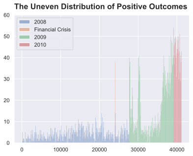
    


Oct 2008 is a special case possibly due to the financial crisis.


```python
bank_mkt[["date", "y"]].groupby("date").mean().plot.line(ylabel="", title="Positive Rate by Month", legend=False);
```


    <AxesSubplot:title={'left':'Positive Rate by Month'}, xlabel='date'>


    
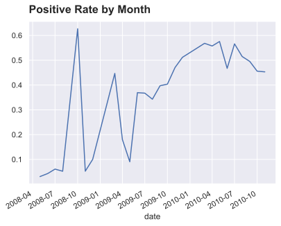
    


### Missing values

By checking the number of missing values, we can see nearly all client do not have `pdays` and `poutcome`. 20% of the clients do not have information of `default`.


```python
na = bank_mkt.isna().sum()
na_nonzero = na[na != 0]
na_perc = na_nonzero/bank_mkt.y.count()
na_bar = na_perc.plot.bar(title="Percentage of Missing Values")
```


    
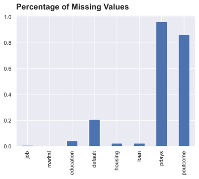
    


### Client Data

Let's start with basic client data.

Most of the clients's age are between 32 to 47 while there are some outlier cases beyond 70. This may imply that we should choose standardization for scaling since it's more tolerant for outliers.


```python
age_hist = bank_mkt["age"].plot.hist(title="Age Histogram")
```


    
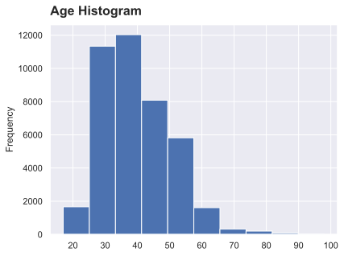
    


```python
age_box = bank_mkt["age"].plot.box(vert=False, sym=".", title="Age Distribution")
```


    
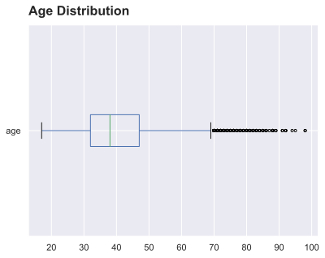
    


From the graph below we can see that the age distribution in the true outcome group has lower median age but is more skewed toward an slightly older population.


```python
age_y = bank_mkt[["age", "y"]].pivot(columns="y", values="age")
age_hist_outcome = age_y.plot.hist(alpha=0.9, legend=True, title="Age Histogram by Outcome")
```


    

    


```python
age_box_outcome = age_y.plot.box(vert=False, sym=".", title="Age Distribution by Outcome")
```


    
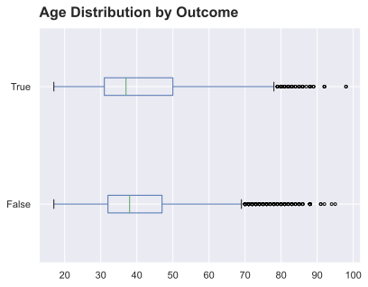
    


We can also inspect the relationship between age and other categorical values.


```python
age_job = bank_mkt[["age", "job"]].pivot(columns="job", values="age")
age_job_box = age_job.plot.box(vert=False, sym=".", title="Age Distribution by Job")
```


    

    


```python
age_education = bank_mkt[["age", "education"]].pivot(columns="education", values="age")
age_education_box = age_education.plot.box(vert=False, sym=".", title="Age Distribution by Education")
```


    
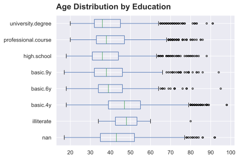
    


```python
age_marital = bank_mkt[["age", "marital"]].pivot(columns="marital", values="age")
age_marital_box = age_marital.plot.box(vert=False, sym=".", title="Age Distribution by Marital Status")
```


    
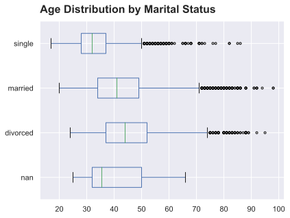
    


```python
age_default = bank_mkt[["age", "default"]].pivot(columns="default", values="age")
age_default_box = age_default.plot.box(vert=False, sym=".", title="Age Distribution by Default")
```


    
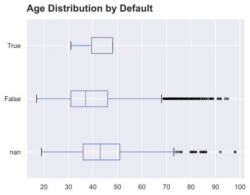
    


```python
age_housing = bank_mkt[["age", "housing"]].pivot(columns="housing", values="age")
age_housing_box = age_housing.plot.box(vert=False, sym=".", title="Age Distribution by Housing")
```


    
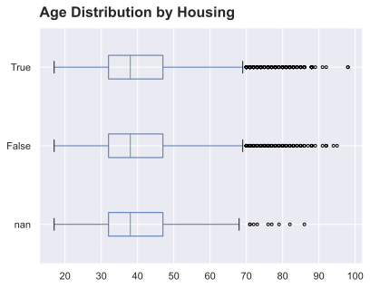
    


```python
age_loan = bank_mkt[["age", "loan"]].pivot(columns="loan", values="age")
age_loan_box = age_loan.plot.box(vert=False, sym=".", title="Age Distribution by Loan")
```


    

    


We can then turn to job, eductaion and other categorical data to see their relationship to the outcome.


```python
def explore_cat(df, feature):
    df = df.copy()
    if pd.api.types.is_categorical_dtype(df[feature]):
        df[feature] = df[feature].cat.add_categories('unknown')
        df[feature] = df[feature].fillna("unknown")
    feature_true = df[[feature, "y"]].groupby([feature]).sum().y.rename("True")
    feature_total = df[[feature, "y"]].groupby([feature]).count().y.rename("Total")
    feature_false = feature_total - feature_true
    feature_false = feature_false.rename("False")
    feature_true_rate = feature_true / feature_total
    feature_true_rate = feature_true_rate.rename("True Percentage")
    explore_df = pd.concat([feature_true, feature_false, feature_total, feature_true_rate], axis=1).reset_index()
    return explore_df
```


```python
def cat_outcome(df, feature):
    df = df.copy()
    if pd.api.types.is_categorical_dtype(df[feature]) and df[feature].isna().sum() > 0:
        df[feature] = df[feature].cat.add_categories("unknown")
        df[feature] = df[feature].fillna("unknown")
    title = feature.title().replace("_", " ").replace("Of", "of")
    f, axs = plt.subplots(1, 2, figsize=(8.6, 4.8), sharey=True, gridspec_kw=dict(wspace=0.04, width_ratios=[5, 2]))
    ax0 = df["y"].groupby(df[feature], dropna=False).value_counts(normalize=True).unstack().plot.barh(xlabel="", legend=False, stacked=True, ax=axs[0], title=f"Outcome Percentage and Total by {title}")
    ax1 = df["y"].groupby(df[feature], dropna=False).value_counts().unstack().plot.barh(xlabel="", legend=False, stacked=True, ax=axs[1])
```


```python
job_outcome = cat_outcome(bank_mkt, "job")
```


    
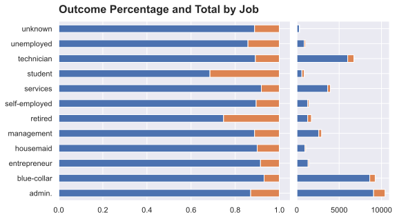
    


```python
marital_outcome = cat_outcome(bank_mkt, "marital")
```


    
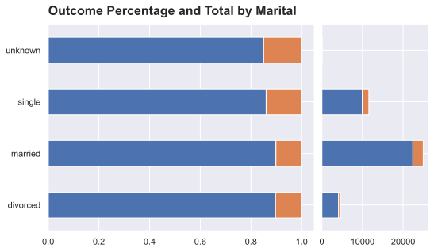
    


```python
education_outcome = cat_outcome(bank_mkt, "education")
```


    
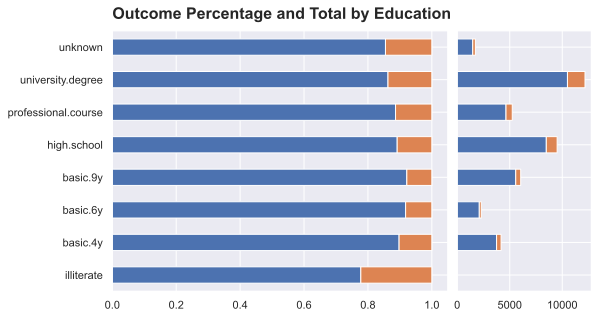
    


```python
bank_mkt["default"].value_counts()
```


    False    32577
    True         3
    Name: default, dtype: Int64


```python
default_outcome = cat_outcome(bank_mkt, "default")
```


    

    


```python
housing_outcome = cat_outcome(bank_mkt, "housing")
```


    
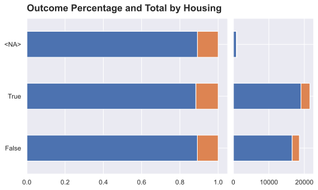
    


```python
loan_outcome = cat_outcome(bank_mkt, "loan")
```


    
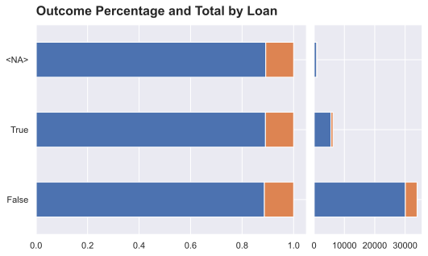
    


```python
job_marital_total = bank_mkt[["job", "marital", "y"]].groupby(["job", "marital"]).count().y.unstack()
job_marital_true = bank_mkt[["job", "marital", "y"]].groupby(["job", "marital"]).sum().y.unstack()
job_marital_rate = job_marital_true / job_marital_total
job_marital_rate = job_marital_rate.rename_axis(None, axis=0).rename_axis(None, axis=1)
job_marital_heatmap = sns.heatmap(data=job_marital_rate, vmin=0, vmax=0.5, annot=True).set_title("True Outcome Percentage by Job and Marital Status")
```


    
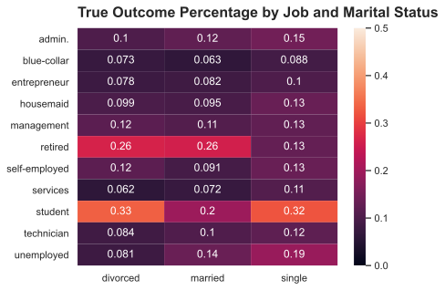
    


```python
job_education_total = bank_mkt[["job", "education", "y"]].groupby(["job", "education"]).count().y.unstack()
job_education_true = bank_mkt[["job", "education", "y"]].groupby(["job", "education"]).sum().y.unstack()
job_education_rate = job_education_true / job_education_total
job_education_rate = job_education_rate.rename_axis(None, axis=0).rename_axis(None, axis=1)
job_education_heatmap = sns.heatmap(data=job_education_rate, vmin=0, vmax=0.5, annot=True).set_title("True Outcome Percentage by Job and Education")
```


    
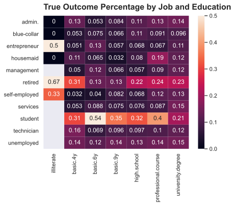
    


```python
education_marital_total = bank_mkt[["education", "marital", "y"]].groupby(["education", "marital"]).count().y.unstack()
education_marital_true = bank_mkt[["education", "marital", "y"]].groupby(["education", "marital"]).sum().y.unstack()
education_marital_rate = education_marital_true / education_marital_total
education_marital_rate = education_marital_rate.rename_axis(None, axis=0).rename_axis(None, axis=1)
education_marital_heatmap = sns.heatmap(data=education_marital_rate, vmin=0, vmax=0.5, annot=True).set_title("True Outcome Percentage by Education and Marital Status")
```


    
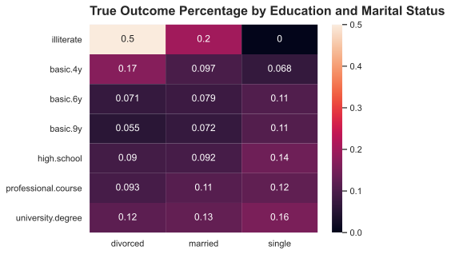
    


### Current Campaign


```python
contact_outcome = cat_outcome(bank_mkt, "contact")
```


    
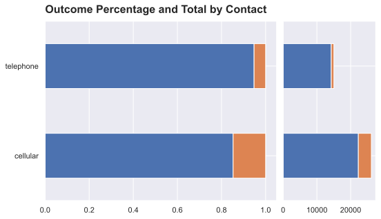
    


```python
month_outcome = cat_outcome(bank_mkt, "month")
```


    
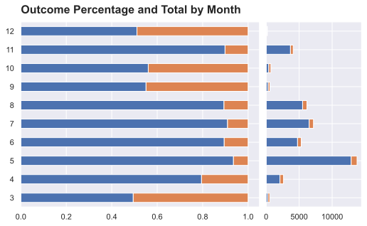
    


```python
day_outcome = cat_outcome(bank_mkt, "day_of_week")
```


    
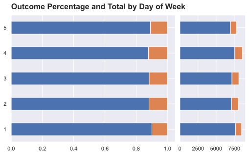
    


### Previous Campaign

We can plot the dirstribution of `pdays` and `previous`. As we can see, most of the client with `pdays` has been contacted 3 to 6 days before and peaked at 3 and 6 days.


```python
pdays_hist = bank_mkt["pdays"].plot.hist(bins=27, title="Number of Days Since Last Contact Histogram")
```


    
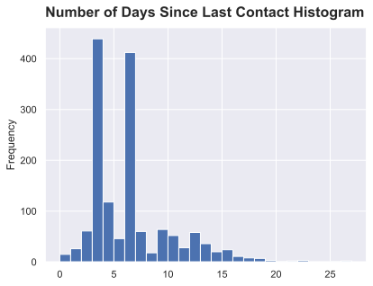
    


Most of the client has never been contacted before.


```python
previous_hist = bank_mkt["previous"].plot.hist(title="Number of Contacts Histogram")
```


    
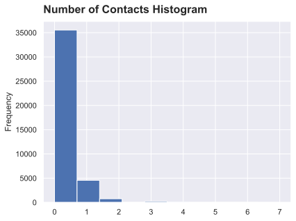
    


If `pdays` is missing value, that means that the client was not previously contacted and therefore should not have `poutcome`. But `poutcome` column has less missing values than `pdays`. 


```python
previous_na = bank_mkt[["pdays", "poutcome"]].isna().sum()
previous_na_ax = previous_na.plot.bar(title="Number of Missing Values in pdays and poutcome")
```


    
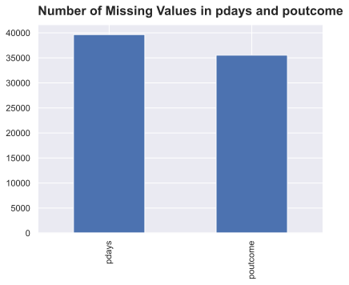
    


We can print out the 4110 rows where the client is not contacted but have `poutcome` and see how many times they have been contacted before. The figures suggest that maybe these clients has been actually contacted but it was more than 30 days ago so the contact date was not recorded. This leaves us plenty room for feature engineering.


```python
previous = bank_mkt[["campaign", "pdays", "previous", "poutcome", "y"]]
previous = previous[previous["pdays"].isna() & previous["poutcome"].notna()].reset_index(drop=True)
previous
```


<div>
<style scoped>
    .dataframe tbody tr th:only-of-type {
        vertical-align: middle;
    }

    .dataframe tbody tr th {
        vertical-align: top;
    }

    .dataframe thead th {
        text-align: right;
    }
</style>
<table border="1" class="dataframe">
  <thead>
    <tr style="text-align: right;">
      <th></th>
      <th>campaign</th>
      <th>pdays</th>
      <th>previous</th>
      <th>poutcome</th>
      <th>y</th>
    </tr>
  </thead>
  <tbody>
    <tr>
      <th>0</th>
      <td>1</td>
      <td>&lt;NA&gt;</td>
      <td>1</td>
      <td>False</td>
      <td>False</td>
    </tr>
    <tr>
      <th>1</th>
      <td>1</td>
      <td>&lt;NA&gt;</td>
      <td>1</td>
      <td>False</td>
      <td>True</td>
    </tr>
    <tr>
      <th>2</th>
      <td>1</td>
      <td>&lt;NA&gt;</td>
      <td>1</td>
      <td>False</td>
      <td>False</td>
    </tr>
    <tr>
      <th>3</th>
      <td>1</td>
      <td>&lt;NA&gt;</td>
      <td>1</td>
      <td>False</td>
      <td>True</td>
    </tr>
    <tr>
      <th>4</th>
      <td>1</td>
      <td>&lt;NA&gt;</td>
      <td>1</td>
      <td>False</td>
      <td>False</td>
    </tr>
    <tr>
      <th>...</th>
      <td>...</td>
      <td>...</td>
      <td>...</td>
      <td>...</td>
      <td>...</td>
    </tr>
    <tr>
      <th>4105</th>
      <td>1</td>
      <td>&lt;NA&gt;</td>
      <td>1</td>
      <td>False</td>
      <td>True</td>
    </tr>
    <tr>
      <th>4106</th>
      <td>2</td>
      <td>&lt;NA&gt;</td>
      <td>4</td>
      <td>False</td>
      <td>False</td>
    </tr>
    <tr>
      <th>4107</th>
      <td>1</td>
      <td>&lt;NA&gt;</td>
      <td>2</td>
      <td>False</td>
      <td>True</td>
    </tr>
    <tr>
      <th>4108</th>
      <td>1</td>
      <td>&lt;NA&gt;</td>
      <td>2</td>
      <td>False</td>
      <td>False</td>
    </tr>
    <tr>
      <th>4109</th>
      <td>3</td>
      <td>&lt;NA&gt;</td>
      <td>1</td>
      <td>False</td>
      <td>False</td>
    </tr>
  </tbody>
</table>
<p>4110 rows × 5 columns</p>
</div>


```python
previous_ax = previous["previous"].plot.hist(bins=12, title="Number of Days Since Last Contact")
```


    
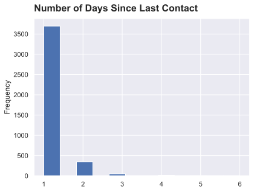
    


```python
bank_mkt[bank_mkt["pdays"].isna() & bank_mkt["poutcome"].isna()]
```


<div>
<style scoped>
    .dataframe tbody tr th:only-of-type {
        vertical-align: middle;
    }

    .dataframe tbody tr th {
        vertical-align: top;
    }

    .dataframe thead th {
        text-align: right;
    }
</style>
<table border="1" class="dataframe">
  <thead>
    <tr style="text-align: right;">
      <th></th>
      <th>age</th>
      <th>job</th>
      <th>marital</th>
      <th>education</th>
      <th>default</th>
      <th>housing</th>
      <th>loan</th>
      <th>contact</th>
      <th>month</th>
      <th>day_of_week</th>
      <th>duration</th>
      <th>campaign</th>
      <th>pdays</th>
      <th>previous</th>
      <th>poutcome</th>
      <th>emp.var.rate</th>
      <th>cons.price.idx</th>
      <th>cons.conf.idx</th>
      <th>euribor3m</th>
      <th>nr.employed</th>
      <th>y</th>
      <th>year</th>
      <th>date</th>
    </tr>
  </thead>
  <tbody>
    <tr>
      <th>0</th>
      <td>56</td>
      <td>housemaid</td>
      <td>married</td>
      <td>basic.4y</td>
      <td>False</td>
      <td>False</td>
      <td>False</td>
      <td>telephone</td>
      <td>5</td>
      <td>1</td>
      <td>261</td>
      <td>1</td>
      <td>&lt;NA&gt;</td>
      <td>0</td>
      <td>&lt;NA&gt;</td>
      <td>1.1</td>
      <td>93.994</td>
      <td>-36.4</td>
      <td>4.857</td>
      <td>5191.0</td>
      <td>False</td>
      <td>2008</td>
      <td>2008-05-01</td>
    </tr>
    <tr>
      <th>1</th>
      <td>57</td>
      <td>services</td>
      <td>married</td>
      <td>high.school</td>
      <td>&lt;NA&gt;</td>
      <td>False</td>
      <td>False</td>
      <td>telephone</td>
      <td>5</td>
      <td>1</td>
      <td>149</td>
      <td>1</td>
      <td>&lt;NA&gt;</td>
      <td>0</td>
      <td>&lt;NA&gt;</td>
      <td>1.1</td>
      <td>93.994</td>
      <td>-36.4</td>
      <td>4.857</td>
      <td>5191.0</td>
      <td>False</td>
      <td>2008</td>
      <td>2008-05-01</td>
    </tr>
    <tr>
      <th>2</th>
      <td>37</td>
      <td>services</td>
      <td>married</td>
      <td>high.school</td>
      <td>False</td>
      <td>True</td>
      <td>False</td>
      <td>telephone</td>
      <td>5</td>
      <td>1</td>
      <td>226</td>
      <td>1</td>
      <td>&lt;NA&gt;</td>
      <td>0</td>
      <td>&lt;NA&gt;</td>
      <td>1.1</td>
      <td>93.994</td>
      <td>-36.4</td>
      <td>4.857</td>
      <td>5191.0</td>
      <td>False</td>
      <td>2008</td>
      <td>2008-05-01</td>
    </tr>
    <tr>
      <th>3</th>
      <td>40</td>
      <td>admin.</td>
      <td>married</td>
      <td>basic.6y</td>
      <td>False</td>
      <td>False</td>
      <td>False</td>
      <td>telephone</td>
      <td>5</td>
      <td>1</td>
      <td>151</td>
      <td>1</td>
      <td>&lt;NA&gt;</td>
      <td>0</td>
      <td>&lt;NA&gt;</td>
      <td>1.1</td>
      <td>93.994</td>
      <td>-36.4</td>
      <td>4.857</td>
      <td>5191.0</td>
      <td>False</td>
      <td>2008</td>
      <td>2008-05-01</td>
    </tr>
    <tr>
      <th>4</th>
      <td>56</td>
      <td>services</td>
      <td>married</td>
      <td>high.school</td>
      <td>False</td>
      <td>False</td>
      <td>True</td>
      <td>telephone</td>
      <td>5</td>
      <td>1</td>
      <td>307</td>
      <td>1</td>
      <td>&lt;NA&gt;</td>
      <td>0</td>
      <td>&lt;NA&gt;</td>
      <td>1.1</td>
      <td>93.994</td>
      <td>-36.4</td>
      <td>4.857</td>
      <td>5191.0</td>
      <td>False</td>
      <td>2008</td>
      <td>2008-05-01</td>
    </tr>
    <tr>
      <th>...</th>
      <td>...</td>
      <td>...</td>
      <td>...</td>
      <td>...</td>
      <td>...</td>
      <td>...</td>
      <td>...</td>
      <td>...</td>
      <td>...</td>
      <td>...</td>
      <td>...</td>
      <td>...</td>
      <td>...</td>
      <td>...</td>
      <td>...</td>
      <td>...</td>
      <td>...</td>
      <td>...</td>
      <td>...</td>
      <td>...</td>
      <td>...</td>
      <td>...</td>
      <td>...</td>
    </tr>
    <tr>
      <th>41169</th>
      <td>37</td>
      <td>admin.</td>
      <td>married</td>
      <td>university.degree</td>
      <td>False</td>
      <td>True</td>
      <td>False</td>
      <td>cellular</td>
      <td>11</td>
      <td>5</td>
      <td>281</td>
      <td>1</td>
      <td>&lt;NA&gt;</td>
      <td>0</td>
      <td>&lt;NA&gt;</td>
      <td>-1.1</td>
      <td>94.767</td>
      <td>-50.8</td>
      <td>1.028</td>
      <td>4963.6</td>
      <td>True</td>
      <td>2010</td>
      <td>2010-11-01</td>
    </tr>
    <tr>
      <th>41171</th>
      <td>73</td>
      <td>retired</td>
      <td>married</td>
      <td>professional.course</td>
      <td>False</td>
      <td>True</td>
      <td>False</td>
      <td>cellular</td>
      <td>11</td>
      <td>5</td>
      <td>334</td>
      <td>1</td>
      <td>&lt;NA&gt;</td>
      <td>0</td>
      <td>&lt;NA&gt;</td>
      <td>-1.1</td>
      <td>94.767</td>
      <td>-50.8</td>
      <td>1.028</td>
      <td>4963.6</td>
      <td>True</td>
      <td>2010</td>
      <td>2010-11-01</td>
    </tr>
    <tr>
      <th>41172</th>
      <td>46</td>
      <td>blue-collar</td>
      <td>married</td>
      <td>professional.course</td>
      <td>False</td>
      <td>False</td>
      <td>False</td>
      <td>cellular</td>
      <td>11</td>
      <td>5</td>
      <td>383</td>
      <td>1</td>
      <td>&lt;NA&gt;</td>
      <td>0</td>
      <td>&lt;NA&gt;</td>
      <td>-1.1</td>
      <td>94.767</td>
      <td>-50.8</td>
      <td>1.028</td>
      <td>4963.6</td>
      <td>False</td>
      <td>2010</td>
      <td>2010-11-01</td>
    </tr>
    <tr>
      <th>41173</th>
      <td>56</td>
      <td>retired</td>
      <td>married</td>
      <td>university.degree</td>
      <td>False</td>
      <td>True</td>
      <td>False</td>
      <td>cellular</td>
      <td>11</td>
      <td>5</td>
      <td>189</td>
      <td>2</td>
      <td>&lt;NA&gt;</td>
      <td>0</td>
      <td>&lt;NA&gt;</td>
      <td>-1.1</td>
      <td>94.767</td>
      <td>-50.8</td>
      <td>1.028</td>
      <td>4963.6</td>
      <td>False</td>
      <td>2010</td>
      <td>2010-11-01</td>
    </tr>
    <tr>
      <th>41174</th>
      <td>44</td>
      <td>technician</td>
      <td>married</td>
      <td>professional.course</td>
      <td>False</td>
      <td>False</td>
      <td>False</td>
      <td>cellular</td>
      <td>11</td>
      <td>5</td>
      <td>442</td>
      <td>1</td>
      <td>&lt;NA&gt;</td>
      <td>0</td>
      <td>&lt;NA&gt;</td>
      <td>-1.1</td>
      <td>94.767</td>
      <td>-50.8</td>
      <td>1.028</td>
      <td>4963.6</td>
      <td>True</td>
      <td>2010</td>
      <td>2010-11-01</td>
    </tr>
  </tbody>
</table>
<p>35551 rows × 23 columns</p>
</div>


### Correlation Heatmap


```python
corr_heatmap = sns.heatmap(data=bank_mkt.corr(method="pearson")).set_title("Correlation Heatmap")
```


    
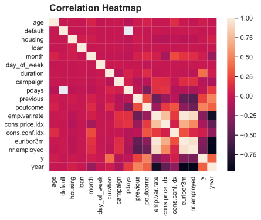
    

