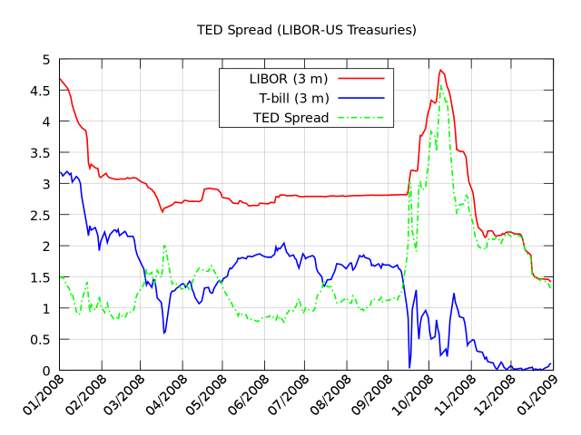

# Introduction

## Motivation

A retail bank has a customer call centre as one of its units, through which the bank communicates with potential new clients and offers term deposits. Term deposits are defined as a fixed-term investment that includes the deposit of money into an account at a financial institution.

It is obvious that such an instrument would generate revenue for the bank, hence the bank records the outcomes of these phone calls along side other data related to the person being called, the economic benchmarks at the time of the call and certain parameters of previous contact with the given person.
The motivation behind the research is clear, by analysing previous phone calls the bank would like to improve it's results in two dimensions:

1. The efficiency dimension, or in other words how to reduce the number of phone calls the bank is performing and therefor reduce the costs associated with telemarketing
2. The effectiveness dimension, or in other words how to potentially improve the result and get more clients or at least the same number to deposit their money with our bank

In order to fully understand the objectives at hand we must also appreciate the economic and historic context from which we draw our data. It is the year 2008 and the world is about to be plunged in the deepest economic recession since the 1930s. After the credit default of The Lehman Brothers, the financial world was shook to its core and governments as well as central banks started unprecedented levels of quantitative easing in order to save jobs and revitalize the economy. 

As can be seen on the above picture this caused a huge spike in the famous TED spread, one of the leading indicators for credit risk, since it represents the difference between a riskless investment (T-Bill) and the risk banks transfer when loaning to each other. The wider the spread, the more default risk is priced into the borrowing market. It takes no further economic knowledge to conclude that such an increase in risk will have major impact not only on the result of the telemarketing campaign but the representability and timelessness of the data gathered through it.

At this point in time it would be a good idea to raise a few questions that we plan on answering through this paper.

1. *How did the economic crisis affect consumer behaviour and how did it manifest itself in the data ?*

2. *How does one's education, marital status, job... affect their economic choices ?*

3. *Do people better respond to frequent calls, or first contact ?*

4. *Do they prefer being called on the mobile phone or landline ?*

And ultimately can we develop a data driven, machine learning approach to tackle this problem and answer the outlined questions?

## Dataset Description

At our disposal we had 20 input and 1 output feature to work with. The input features were categorized and given to us as follows:

**A. Bank client data:**

`age`: age (numeric)

`job`: type of job (categorical: 'admin.', 'blue-collar', 'entrepreneur', 'housemaid', 'management',
'retired', 'self-employed', 'services', 'student', 'technician', 'unemployed', 'unknown')

`marital`: marital status (categorical: 'divorced', 'married', 'single', 'unknown'; note: 'divorced'
means divorced or widowed)

`education`: (categorical: 'basic.4y', 'basic.6y', 'basic.9y', 'high.school', 'illiterate',
'professional.course', 'university.degree', 'unknown')

`default`: has credit in default? (categorical: 'no', 'yes', 'unknown')

`housing`: has housing loan? (categorical: 'no', 'yes', 'unknown')

`loan`: has personal loan? (categorical: 'no', 'yes', 'unknown')

**B. Related with the last contact of the current campaign:**

`contact`: contact communication type (categorical: 'cellular', 'telephone')

`month`: last contact month of year (categorical: 'jan', 'feb', 'mar', ..., 'nov', 'dec')

`day_of_week`: last contact day of the week (categorical: 'mon', 'tue', 'wed', 'thu', 'fri')

`duration`: last contact duration, in seconds (numeric). Important note: this attribute highly
affects the output target (e.g., if duration=0 then y='no'). Yet, the duration is not known before a
call is performed. Also, after the end of the call y is obviously known. Thus, this input should only
be included for benchmark purposes and should be discarded if the intention is to have a
realistic predictive model.

**C. Other attributes:**

`campaign`: number of contacts performed during this campaign and for this client (numeric,
includes last contact)

`pdays`: number of days that passed by after the client was last contacted from a previous
campaign (numeric; 999 means client was not previously contacted)

`previous`: number of contacts performed before this campaign and for this client (numeric)

`poutcome`: outcome of the previous marketing campaign (categorical: 'failure', 'nonexistent',
'success')

**D. Social and economic context attributes**

`emp.var.rate`: employment variation rate, quarterly indicator (numeric)

`cons.price.idx`: consumer price index, monthly indicator (numeric)

`cons.conf.idx`: consumer confidence index, monthly indicator (numeric)

`euribor3m`: euribor 3 month rate, daily indicator (numeric)

`nr.employed`: number of employees, quarterly indicator (numeric)

**Output variable (desired target):**

`y`: has the client subscribed a term deposit? (binary: 'yes', 'no')

The obvious challenge is the large number of categorical and or Boolean features, how to approach them and handle them appropriately.
