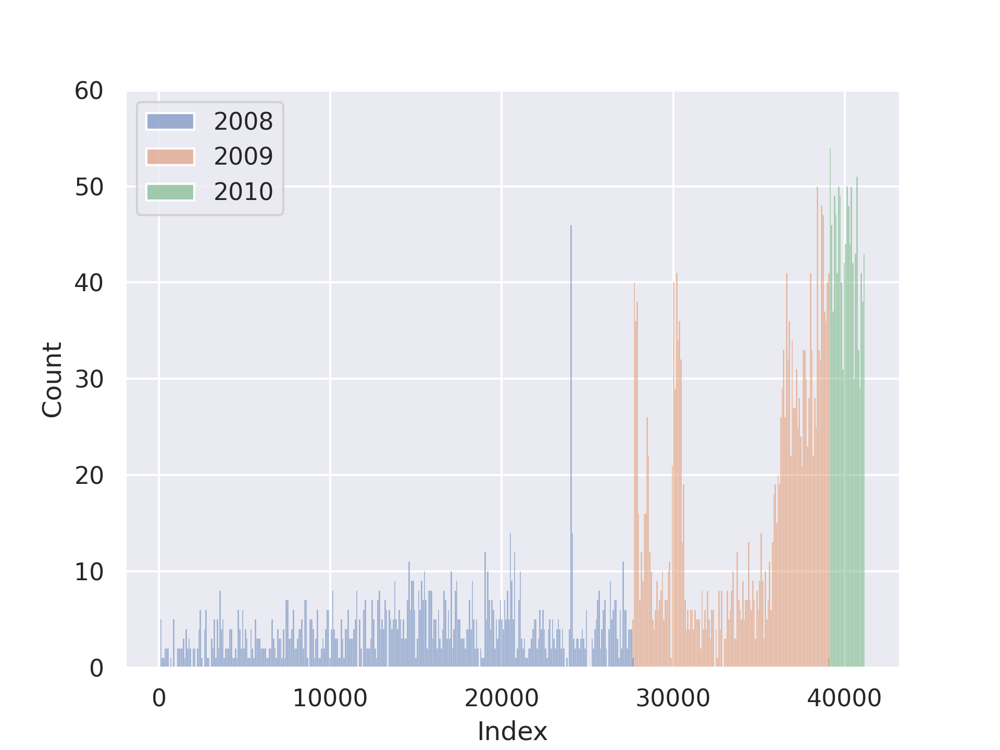

# Exploratory Data Analysis
Exploratory Data Analysis is a process to explore the dataset with no assumptions or hypothesis [@geron_2019]. The objective is to give us enough insights for the future work.


## Insert Local Image


## Paste Pic from web


## Code block
```python
def some_code():
    return magic_python
``` 

## Refer to code
This text, see function `some_code()`. 


## Math Function
$$
F = ma
$$


## Hyperlink
SEE [Google](http://www.google.com)


## Citation
This is citation [@raschka_python_2019].

---------------------------------------------------------