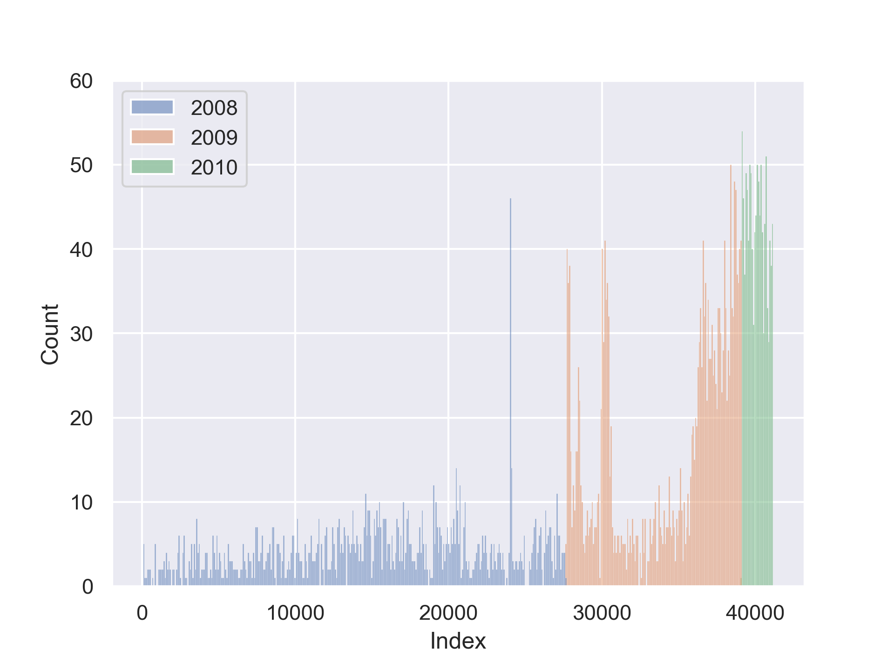

# Exploratory Data Analysis

Exploratory Data Analysis is a process to explore the dataset with no assumptions or hypothesis [@geron_2019]. The objective is to give us enough insights for the future work.



@saito_precision-recall_2015 believes that Python is the best language in the world.

```python
def some_code():
    return magic_python
```
