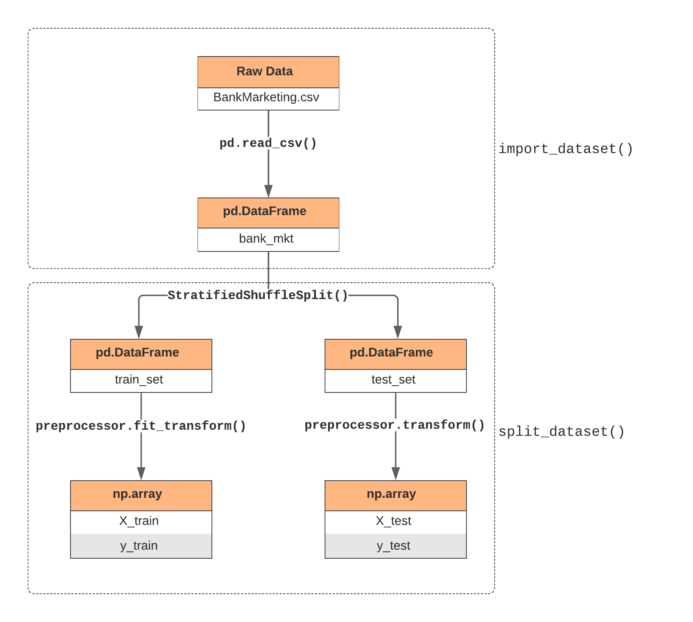

# Data Preparation and Pipelines
 
After inspecting and exploring the dataset, this chapter focuses on data preparation and pipelines which build the foundation for the following chapters. Data preparation or data transfromation is a process that transforms the data into proper types, shapes and sets. For example, categorical data are usually stored as strings in the original dataset and can not be fitted in `scikit-learn` models. To solve this issue, We need to utilise `pandas` or `scikit-learn` to transform such data into integers. It should be noted that simply transforming data in a `jupyter` notebook is not a best practice because such code is not reusable and readable. In our analytical practice, we wrap data preparation code into documented and modular `python` functions and `scikit-learn` pipelines. Such practice ensures that all collaborators can build and evaluate models from the same ground. The high level overview of the data preparation and pipeline is shown in the flow chart. The detailed code implementation will be provided in the appendix section.



## Import Data

First, the `BankMarkteting.csv` file is imported using `read_csv()` from `pandas` and duplicated rows, missing values, categorical and boolean data are properly processed. The import process is abstracted into the function `import_dataset()`. A sample code is shown below:

```python
import pandas as pd

# Import data from csv file
bank_mkt = pd.read_csv(
    "../data/BankMarketing.csv",
    na_values=["unknown", "nonexistent"],
    true_values=["yes", "success"],
    false_values=["no", "failure"],
)
# Treat pdays = 999 as missing values
bank_mkt["pdays"] = bank_mkt["pdays"].replace(999, pd.NA)
# Drop 12 duplicated rows
bank_mkt = bank_mkt.drop_duplicates().reset_index(drop=True)
# Convert types
    bank_mkt = bank_mkt.astype(
        dtype={
            "job": "category",
            "marital": "category",
            "education": "category",
            "y": "boolean",
        }
```

## Partition Data

After importing the data, we need split the dataset into train set and test set. The models will be trained and tuned on the trainning set and test set will be used only for final validation purposes. However, simply sampling the dataset may lead to unrepresenatative partition given that our dataset is imbalanced and clients have different features. To solve this problem, `scikit-learn` provides a useful function `StratifiedShuffleSplit()` to select representative data into test set and train set, which is shown below as sample code:

```python
from sklearn.model_selection import StratifiedShuffleSplit

train_test_split = StratifiedShuffleSplit(n_splits=1, test_size=0.2)
for train_index, test_index in train_test_split.split(
    bank_mkt.drop("y", axis=1), bank_mkt["y"]
):
    train_set = bank_mkt.iloc[train_index]
    test_set = bank_mkt.iloc[test_index]

X_train = train_set.drop(["duration", "y"], axis=1)
y_train = train_set["y"].astype("int").to_numpy()
X_test = test_set.drop(["duration", "y"], axis=1)
y_test = test_set["y"].astype("int").to_numpy()
```

## Build Custom Preprocess Pipeline

After data partition, the train set and test set should be preprocessed into sutiable data type and shape for machine learning models. The train set and test set should also be preprocessed seperately to avoid leaking test sample infomation into train set. If we scale data using both train set and test set, the scaling will ultimately be impacted by some test samples, which is not disired. To avoid the leakage, `scikit-learn` provides pipeline functionality that allows different treatments on train set and test set using `fit_transform()` and `transform()` as demostrated in the code below:

```python
# preprocessor is a custom pipeline for preprocessing data
X_train = preprocessor.fit_transform(X_train, y_train)
X_test = preprocessor.transform(X_test)
```

Note that `preprocessor` is a custom preprocessing pipeline that we wrote for this specific project and can be named differently. A simplest preprocessor is a function that do some transformations in `pandas` as the following code:

```python
from sklearn.preprocessing import FunctionTransformer

def encode_fn(X):
    """Encode categorical and boolean features into numeric values."""
    X = X.copy()
    X = X.apply(lambda x: x.cat.codes if pd.api.types.is_categorical_dtype(x) else (x.astype("Int64") if pd.api.types.is_bool_dtype(x) else x))
    X = X.astype("float")
    return X

encode_preprocessor = FunctionTransformer(encode_fn)
X_train = encode_preprocessor.fit_transform(X_train, y_train)
X_test = encode_preprocessor.transform(X_test)
```

Preprocessing pipeline can be extended according to our needs. For example, we might need one-hot encode categorical features and standardize numerical features after transforming categorical and boolean features into numeric values.

```python
from sklearn.preprocessing import StandardScaler
from sklearn.preprocessing import OneHotEncoder
from sklearn.compose import ColumnTransformer
from sklearn.pipeline import make_pipeline
cat_features = ["job",
                "marital",
                "education",
                "default",
                "housing",
                "loan",
                "poutcome"]

num_features =  ["age",
                 "campaign",
                 "pdays",
                 "previous",
                 "emp.var.rate",
                 "cons.price.idx",
                 "cons.conf.idx",
                 "euribor3m",
                 "nr.employed"]

hot_scaler = ColumnTransformer([
    ("one_hot_encoder", OneHotEncoder(drop="first"), cat_features),
    ("scaler", StandardScaler(), num_features)
], remainder="passthrough")

hot_preprocessor = make_pipeline(FunctionTransformer(encode_fn), hot_scaler)
X_train = hot_preprocessor.fit_transform(X_train, y_train)
X_test = hot_preprocessor.transform(X_test)
```

## From Pipeline To Workflow

In our project, the data partition and preprocessing is combined by the function `split_dataset()` which accepts `preprocessor` as a parameter. Its functionality will be further extended by the benchmarking function `benchmark()` which accepts `data`, `preprocessor`, `clf` as parameters and output model performance. Therefore, the ideal workflow will be:

1. Import data using `import_dataset()`;
2. Build a proper preprocessing pipeline `preprocessor`;
3. Build and tune an estimator `clf`;
4. Show model performance by calling `benchmark(data, preprocessor, clf)`.

Such workflow will be extensively reflected in the following chapters.
