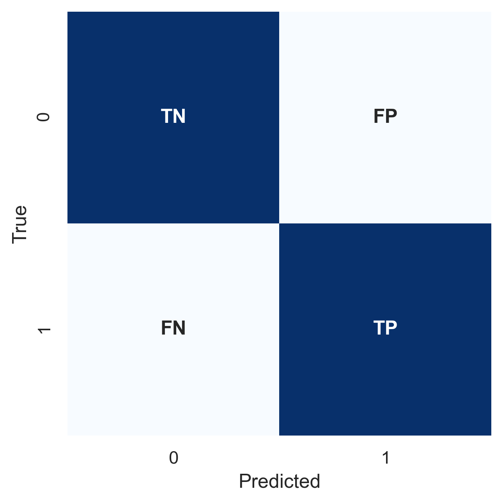
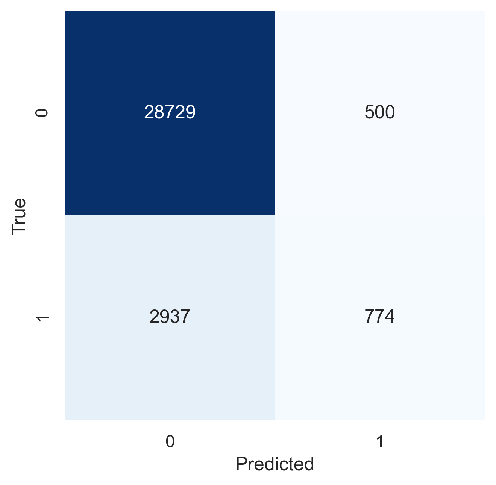

# Performance Evaluation

As discussed in chapter 3, we split data into different sets and tune hyperparameters by comparing model performance on these sets. How do we define the performance of machine learning models? A plain and simple approach is using accuracy scores:

$$
\text{Accuracy} = \frac{\text{Number of Correct Predictions}}{\text{Number of Total Predictions}}
$$

However, accuracy score may be too simplistic. First, it does not reflect the unbalanced outcome of our dataset. If the model predict every outcome as negative while the majority of the outcomes is negative, the model can still achieve a very high accuracy score. Second, accuracy score does not distinct false positive and false negative errors which may cost the business differently. In the bank marketing context, missing a potential customer (false negative) costs more than phoning an uninterested buyer (false positive). These problems can be solved by using confusion matrix and utilising more metrics for model evaluation. 

## Confusion Matrix
The confusion matrix is a contingency table that outputs the counts of the true positive (TP), true negative (TN), false positive (FP), and false negative (FN) predictions. We can use an analogy of fishing to gain more intuitions: The sea consists of fish and rubbish. A fisherman throws the net into the sea and hopes to capture as many fish and as little rubbish as possible. After the fisherman retrives the net, the fish in the net (the wanted capture) is true positive outcome, the rubbish in the net (the unwanted capture) is false positive outcome, the fish in the sea (the wanted leftover) is false nagetive outcome, and the rubbish in the sea (the unwanted leftover) is the true negative outcome.



The confusion matrix can be computed by calling `confusion_matrix` in `scikit-learn` as follows:

```python
from sklearn.model_selection import cross_val_predict
from sklearn.neighbors import KNeighborsClassifier
from sklearn.metrics import confusion_matrix

bank_mkt = import_dataset("../data/BankMarketing.csv")
preprocessor = FunctionTransformer(dftransform)
X_train, y_train, *other_sets = split_dataset(bank_mkt, preprocessor)
clf = KNeighborsClassifier(n_neighbors=10)
y_pred = cross_val_predict(clf, X_train, y_train, cv=5, n_jobs=-1)
conf_mat = confusion_matrix(y_train, y_pred)
f, ax = plt.subplots()
conf_ax = sns.heatmap(
    conf_mat, ax=ax, annot=True, fmt="", cmap=plt.cm.Blues, cbar=False
)
conf_ax.set_xlabel("Predicted")
conf_ax.set_ylabel("True")
```



## Metrics From Confusion Matrix

From the Confusion Matrix, we can derive some key performance metrics such as precision and recall. 

Precision (PRE) measures the accuracy of the predicted positive outcomes. As in the fisherman analogy, precison is the fish in the net divided by the total number of objects (fish and rubbish) in the net.

$$
PRE = \frac{TP}{TP+FP}
$$

Recall (REC) measures the accuracy of the positive samples, also known as sensitivity or the true positive rate (TPR). Using the fishing analogy, recall is the fish in the net divided by the fish population in total.

$$
REC = TPR = \frac{TP}{P} = \frac{TP}{TP+FN}
$$

Precision and recall are usually trade-offs. A fisherman can narrow his net to capture more fish and therefore increase recall. However, it comes at the cost of capturing more rubbish at the same time and decrease precision. To balance these two metrics, the harmonic mean of precision and recall (F1) is used.

$$
F_1 = 2 \cdot \frac{PRE \times REC}{PRE + REC}
$$

The trade-off logic also applies to the true negative rate (TNR) and the true positive rate (TPR). The true negative rate measures the accuracy for the negative samples and the true positive rate measures the accuracy for the negative samples. The false positive rate is simply one minus the true positive rate.

$$
\begin{aligned}
FPR &= \frac{FP}{N} = \frac{FP}{FP+TN} \\
TNR &= \frac{TN}{N} = \frac{TN}{TN+FP} = 1 - FPR \\
TPR &= \frac{TP}{P} = \frac{TP}{TP+FN} 
\end{aligned}
$$

Balanced accuracy (bACC) is the average of true positive rate and true negative rate.

$$
bACC = \frac{TPR+TNR}{2}
$$

A performance metric table of classifiers on bank marketing dataset is shown below.

|      | Constant Prediction | Random Prediction | K-Nearest Neighbors | Linear SVM | Decision Tree | Logistic Regression |
| :--- | ------------------: | ----------------: | ------------------: | ---------: | ------------: | ------------------: |
| FPR  |                   1 |          0.498957 |           0.0171063 | 0.00526874 |      0.143419 |             0.25875 |
| TNR  |                   0 |          0.501043 |            0.982894 |   0.994731 |      0.856581 |             0.74125 |
| TPR  |                   1 |          0.495284 |            0.208569 |  0.0382646 |      0.613851 |            0.698733 |
| bACC |                 0.5 |          0.498164 |            0.595731 |   0.516498 |      0.735216 |            0.719992 |
| REC  |                   1 |          0.495284 |            0.208569 |  0.0382646 |      0.613851 |            0.698733 |
| PRE  |            0.112659 |          0.111923 |            0.607535 |    0.47973 |      0.352087 |            0.255317 |
| F1   |            0.202505 |          0.182586 |            0.310532 |   0.070876 |        0.4475 |            0.373981 |

## Metrics From Threshold

As hinted in the precision-recall trade off, fisherman can narrow or lossen his net. Bank may be happy to capture more potential customers by phoning more clients.Unfortunately, such threshold adjusting mechanism is not reflected by the metrics we have covered. This section introduces receiver operating characteristic (ROC) and average precision (AP) as alternative metrics that incoporate different model thresholds.

Average precision (AP) summarises precision-recall plot as the weighted mean of precisions achieved at each threshold, with the increase in recall from the previous threshold used as the weight.

$$
AP = \sum_{n} (REC_n - REC_{n-1})PRE_n
$$

A receiver operating characteristic (ROC) is a graphical plot which illustrates the performance of a binary classifier system as its discrimination threshold is varied. It is created by plotting TPR against FPR at various threshold settings.

