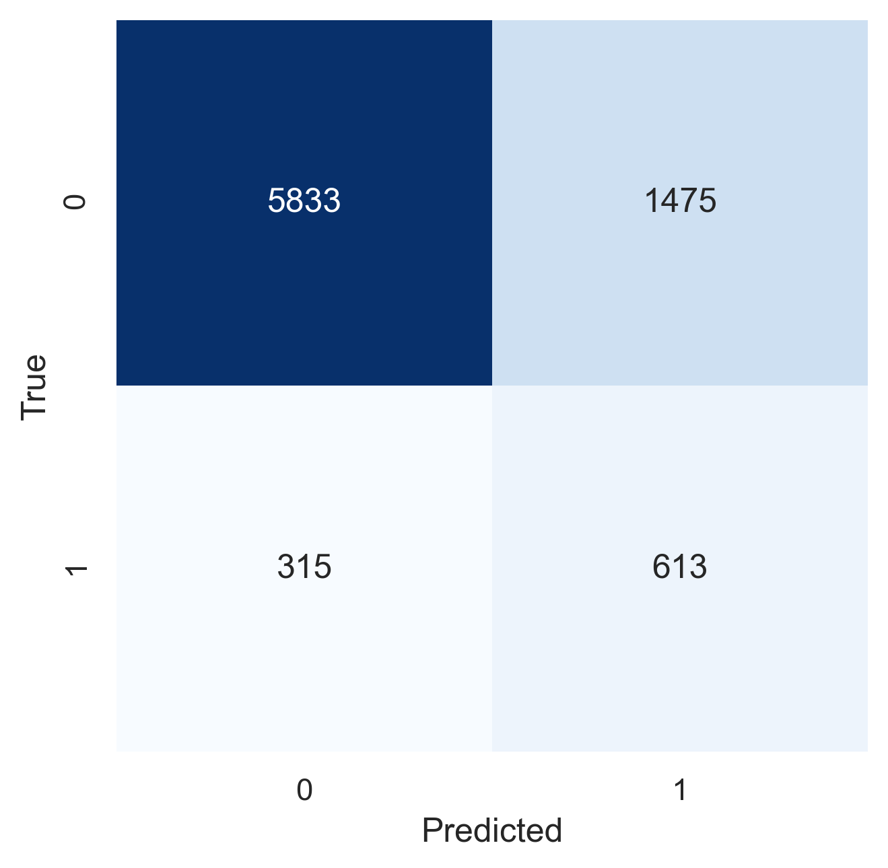
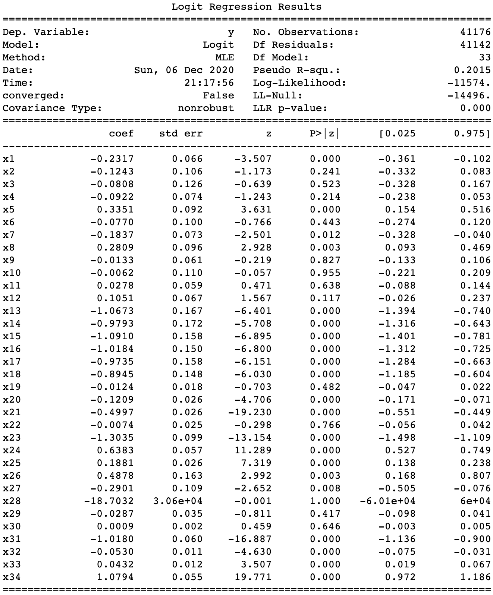

# Logistic Regression
 ```{=latex}
\chapterauthor{Fan Jia}
```

Logistic Regression is commonly used to estimate the probability of an instance belonging to a particular class. If the probability is greater than 50%, the model will classify the instance to that class, otherwise, it will not. Therefore, Logistic Regression is a binary classifier that can be applied to our data set. Underlying the model is the logistic sigmoid function as shown below. This classifier can potentially perform very well on linearly separable classes.

$$h(x)= \frac{1}{1+e^{ -\theta_{0}+\theta_{1}x_{1}+\theta_{2}x_{2}+\theta_{3}x_{3}+...+\theta_{n}x_{n}}}$$

## Initialization 
First, we preprocess the data with one-hot encoding and standardization. Then the Logistic Regression need two important parameters:

1. `class weight = "balanced"`, which is necessary to handle our imbalanced data set; 
2. The maximum number of iterations taken for the solvers to converge.

```python
cat_features = ["job",
                "marital",
                "education",
                "default",
                "housing",
                "loan",
                "poutcome"]

num_features =  ["age",
                 "campaign",
                 "pdays",
                 "previous",
                 "emp.var.rate",
                 "cons.price.idx",
                 "cons.conf.idx",
                 "euribor3m",
                 "nr.employed"]

hot_scaler = ColumnTransformer([
    ("one_hot_encoder", OneHotEncoder(drop="first"), cat_features),
    ("scaler", StandardScaler(), num_features)
], remainder="passthrough")

hot_transformer = make_pipeline(FunctionTransformer(dftransform), hot_scaler)

X_train, y_train, X_test, y_test, *other_sets = split_dataset(bank_mkt, hot_transformer)

lrmodel = LogisticRegression(class_weight='balanced', max_iter=10000) 
```

## Grid Search
Next, we use grid search to find the optimal parameters for the model. For the first grid search, we pick two parameters: the penalty L2 and its inverse parameter C. The L1, L2 regularisation parameters are used to avoid overfitting of data due to either collinearity or high-dimensionality. They both shrink the estimates of the regression coefficients towards zero. When two predictors are highly correlated, L1 will pick one of the two predictors, and in contrast, L2 will keep both of them and jointly shrink the coefficients together a little bit. Parameter C is the inverse of the regularization strength, with smaller values leading to stronger regularization. 

```python
# Try the 1st grid search param_grid combination:
lrmodel = LogisticRegression(class_weight='balanced', max_iter=10000)

# grid search
param_grid = {'penalty': ['l2'],
              'C':[0.001,.009,0.01,0.05,0.09,5,10,25,50,100]}
GS_lrmodel_1 = GridSearchCV(lrmodel, param_grid, scoring='average_precision', n_jobs=-1)
GS_lrmodel_1.fit(X_train, y_train)
lrmodel_gs1 = lrmodel.set_params(**GS_lrmodel_1.best_params_)

# Use calibrated model on train set
lrmodel_gs1.fit(X_train, y_train)
y_train_pred = lrmodel_gs1.predict(X_train)
y_train_score = lrmodel_gs1.decision_function(X_train)
cmtr_gs1 = confusion_matrix(y_train, y_train_pred)
acctr_gs1 = accuracy_score(y_train, y_train_pred)
aps_train_gs1 = average_precision_score(y_train, y_train_score)

# Test the model
lrmodel_gs1.fit(X_test, y_test)
y_test_pred = lrmodel_gs1.predict(X_test)
y_test_score = lrmodel_gs1.decision_function(X_test)
cmte_gs1 = confusion_matrix(y_test, y_test_pred)
accte_gs1 = accuracy_score(y_test, y_test_pred)
aps_test_gs1 = average_precision_score(y_test, y_test_score)
print('Confusion Matrix:\n',cmtr_gs1,'\nAccuracy Score:\n',acctr_gs1, '\nAPS:\n',aps_train_gs1)
print('Confusion Matrix:\n',cmte_gs1,'\nAccuracy Score:\n',accte_gs1, '\nAPS:\n',aps_test_gs1)
print('best parameters:',GS_lrmodel_1.best_params_)
```

The results show a slight improvement compared to the initial model, with a 0.7869 accuracy score, a 0.4418 average precision score and an ROC value of 0.783 for the test set. Additionally, this grid search finds `{'C': 10, 'penalty': 'l2'}` as the best parameter combination. The confusion matrices and performance measures are presented below.

|      | Train    | Validate | Test     |
| ---- | -------- | -------- | -------- |
| TNR  | 0.800539 | 0.808758 | 0.803229 |
| TPR  | 0.663523 | 0.669811 | 0.658405 |
| bACC | 0.732031 | 0.739285 | 0.730817 |
| ROC  | 0.785491 | 0.786075 | 0.782550 |
| REC  | 0.663523 | 0.669811 | 0.658405 |
| PRE  | 0.296955 | 0.307740 | 0.298194 |
| AP   | 0.434798 | 0.459581 | 0.441740 |
: Performance metrics of Logistic Regression with L2 regularisation


For the second grid search, we used the L1 penalty and Elasticnet penalty, which combines L1 and L2 penalties and will give a result in between. We also used the solver “saga”, which supports the non-smooth penalty L1 and is often used to handle the potential multinomial loss in the regression.

```python
# Try the 2nd GridSearch param_grid combination
lrmodel_gs = LogisticRegression(class_weight='balanced',max_iter=10000)

# Grid Search
param_grid = {"C":[0.001,.009,0.01,0.05,0.09,5,10,25,50,100], 
              "penalty":["l1","elasticnet"],
              "solver": ["saga"]}
GS_lrmodel_2 = GridSearchCV(lrmodel_gs, param_grid, scoring='average_precision', n_jobs=-1)
GS_lrmodel_2.fit(X_train, y_train)
lrmodel_gs2 = lrmodel_gs.set_params(**GS_lrmodel_2.best_params_)

# Use calibrated model on train set
lrmodel_gs2.fit(X_train, y_train)
y_train_pred = lrmodel_gs2.predict(X_train)
y_train_score = lrmodel_gs1.decision_function(X_train)
cmtr_gs2 = confusion_matrix(y_train, y_train_pred)
acctr_gs2 = accuracy_score(y_train, y_train_pred)
aps_train_gs2 = average_precision_score(y_train, y_train_pred)

# Test the model
lrmodel_gs2.fit(X_test, y_test)
y_test_pred = lrmodel_gs2.predict(X_test)
y_test_score = lrmodel_gs1.decision_function(X_test)
cmte_gs2 = confusion_matrix(y_test, y_test_pred)
accte_gs2 = accuracy_score(y_test, y_test_pred)
aps_test_gs2 = average_precision_score(y_test, y_test_score)
print('Confusion Matrix:\n',cmtr_gs2,'\nAccuracy Score:\n',acctr_gs1, '\nAPS:\n',aps_train_gs1)
print('Confusion Matrix:\n',cmte_gs2,'\nAccuracy Score:\n',accte_gs2, '\nAPS:\n',aps_test_gs2)
print('best parameters:',GS_lrmodel_2.best_params_)
```

The results from the second Grid Search are almost identical to that of the first Grid Search. However, in the second case, `{'C': 0.05, 'penalty': 'l1', 'solver': 'saga'}` has been identified as the best parameter combination.

|      | Train    | Validate | Test     |
| ---- | -------- | -------- | -------- |
| TNR  | 0.793568 | 0.789942 | 0.798166 |
| TPR  | 0.674301 | 0.648248 | 0.660560 |
| bACC | 0.733935 | 0.719095 | 0.729363 |
| ROC  | 0.788165 | 0.770922 | 0.782781 |
| REC  | 0.674301 | 0.648248 | 0.660560 |
| PRE  | 0.293162 | 0.281451 | 0.293582 |
| AP   | 0.447296 | 0.416163 | 0.441021 |
: Performance metrics of Logistic Regression with L1 regularisation



## Statistical Summary
Finally, we used the `sm.Logit(y, X)` and `summary()` functions to summarise the performance of the Logistic Regression using raw data. Some features showed very promising predictive power, such as the economic indicators, Marital and Education.


